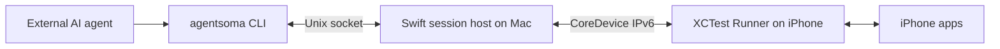

# AgentSoma

**Eyes and hands for AI agents operating a real iPhone.**

**English** · [简体中文](README.zh-CN.md)

[](https://github.com/HughLee824/AgentSoma/actions/workflows/ci.yml)
[](LICENSE)
[](Package.swift)

AgentSoma is a macOS CLI that lets an external agent discover apps, read screenshots and accessibility data, and interact with a connected iPhone. Your agent handles natural language, planning, and judging results; AgentSoma provides device observations and actions through a persistent XCTest session.

An agent needs local command execution and the ability to read PNG files. The device control path runs locally on your Mac and iPhone.

[Website](https://agentsoma.hughlee824.chatgpt.site) · [First iPhone task](docs/first-task.md) · [Client plugins](docs/plugins.md) · [Commands](#commands) · [Documentation](#documentation)

## Why AgentSoma?

- **See the screen and its structure.** Observations return a PNG path, compact accessibility (AX) text, and element references. Expand or search cached snapshots with `inspect`.
- **Act on real apps.** Discover installed apps, bring them to the foreground, tap, swipe, drag, edit text, and send Return.
- **Reuse the device session.** Independent CLI calls share one Mac host and iPhone Runner. `connect` manages startup; `disconnect` or idle expiry releases the session.
- **Know what happened.** Actions distinguish `completed`, `not_dispatched`, and `unknown`. Tap and swipe check the screen before dispatch; input actions check frame stability afterward.
- **Use a small native stack.** Swift, Apple's device tooling, and a thin XCTest Runner. The runtime needs no Python, Node.js, WebDriverAgent, `iproxy`, or `pymobiledevice3`.

## Quick start

For the public install path, follow [Your first iPhone task](docs/first-task.md): Homebrew → Codex or Claude Code plugin → device setup → a verified Settings task. The source workflow below is for development.

### Prerequisites

| Requirement | Details |
| --- | --- |
| Mac and Xcode | Full Xcode selected as the active developer toolchain. Command Line Tools alone are insufficient. |
| Physical iPhone | Connect over USB, trust the Mac, enable Developer Mode, and keep the device unlocked. |
| Development signing | An Apple Development certificate with its private key, plus an iOS development provisioning profile matching the device and Runner bundle ID. |

The documented test environment is **Apple Silicon · macOS 15.0.1 · Xcode 16.0 / Swift 6.0 · iPhone 12 Pro / iOS 26.6**, using an existing paid development team's signing credentials. Free Personal Team setup and renewal have not been validated. See [current limitations](#current-limitations) for compatibility boundaries.

### 1. Install and connect

Choose the source workflow for development, or the packaged workflow when release assets are available. They prepare the Runner differently.

#### From source

```sh
git clone https://github.com/HughLee824/AgentSoma.git
cd AgentSoma
swift build
export PATH="$PWD/.build/debug:$PATH"

agentsoma --help
agentsoma devices
```

Complete the [source signing setup](docs/onboarding.md#源码开发入口) in Xcode, then fill in your team ID and the device ID returned by `devices`:

```sh
export APPLE_TEAM_ID="YOUR_TEAM_ID"
export IOS_UDID="DEVICE_ID_FROM_DEVICES"

agentsoma build-runner --team "$APPLE_TEAM_ID"

# Copy result.xctestrun from the successful build-runner response.
export SIGNED_XCTESTRUN="/absolute/path/from/build-runner.xctestrun"
agentsoma connect --device "$IOS_UDID" --xctestrun "$SIGNED_XCTESTRUN"
```

`build-runner` builds and verifies the signed Runner using the repository's standalone Xcode project. Reuse a compatible build for later connections; rebuild after changing the Runner, its shared code, Xcode, or signing configuration.

#### From a release package

The precompiled release targets **Apple Silicon / macOS 15+**. Install the stable version from the [Homebrew Tap](https://github.com/HughLee824/homebrew-tap), or see [GitHub Releases](https://github.com/HughLee824/AgentSoma/releases) for manual downloads:

```sh
brew install HughLee824/tap/agentsoma
agentsoma --version
```

Alternatively, download the archive and matching SHA-256 file from [GitHub Releases](https://github.com/HughLee824/AgentSoma/releases), verify them, and retain the full package directory. See the [installation guide](docs/install.md) for manual installation, upgrades, and removal.

```sh
agentsoma devices
export IOS_UDID="DEVICE_ID_FROM_DEVICES"

agentsoma setup --device "$IOS_UDID"
agentsoma connect --device "$IOS_UDID"
```

`setup` re-signs the precompiled Runner locally and verifies a device handshake, screenshot capture, and clean shutdown before saving preparation state. It does not compile source, log in to Apple, or create certificates or profiles. Use `--profile`, `--team`, or `--identity` to resolve signing selection; see [onboarding](docs/onboarding.md).

### 2. Observe, act, verify

After either connection workflow, copy the `session` value returned by `connect`:

```sh
export SESSION="SESSION_FROM_CONNECT"

agentsoma --session "$SESSION" status
agentsoma --session "$SESSION" apps --query Settings
agentsoma --session "$SESSION" open com.apple.Preferences
agentsoma --session "$SESSION" observe
```

Read the PNG at the returned `screenshot` path alongside the AX text. The IDs below are illustrative: replace them with references from your actual observation.

```sh
# Search the captured snapshot, or inspect a known element directly.
agentsoma --session "$SESSION" inspect o1 --query General
agentsoma --session "$SESSION" inspect o1:e9

# Use a current reference, then observe again to verify the result.
agentsoma --session "$SESSION" tap o1:e9
agentsoma --session "$SESSION" observe

# Release the session when finished.
agentsoma --session "$SESSION" disconnect
```

The working loop is **observe → read the screenshot → inspect if needed → act → observe again**. A completed action does not establish that the agent's task succeeded.

## Commands

Use `agentsoma --help` or `agentsoma <command> --help` for all options. Session commands use `agentsoma --session "$SESSION" <command>`.

| Command | Purpose |
| --- | --- |
| `devices` | List devices known to CoreDevice and their native connection state. |
| `setup --device ID` | Re-sign and verify a packaged Runner for a device. |
| `build-runner` | Build a signed Runner from source and return its `.xctestrun` path. |
| `connect --device ID` | Start a session; optionally set `--idle-timeout 60m`. |
| `status` | Check session health and remaining idle time without renewing it. |
| `apps [--query TEXT]` | Find installed apps by name or bundle ID; follow `nextOffset` for more results. |
| `open BUNDLE_ID` | Launch or activate an installed app. |
| `observe` | Capture a PNG and compact AX text with new references. |
| `inspect REF [--query TEXT]` | Read or search a cached observation or subtree. |
| `tap REF` | Tap an element, or use an observation ID with `--x X --y Y`. |
| `swipe REF --direction up` | Swipe an element; explicit endpoints, velocity, and hold durations are also supported. |
| `type REF --mode replace --text TEXT` | Replace text, or use `--mode insert` at an already focused caret. `--stdin` accepts UTF-8 from a file or pipe. |
| `press REF --key return` | Send Return to an already focused text input. |
| `disconnect` | Finish accepted commands and clean up the session. |

Coordinates use **screen points**, not screenshot pixels. Swipe direction describes finger movement. Text input does not submit automatically; use a separate `press` when appropriate. See [actions](docs/actions.md) for text limits, dragging, and examples.

## Agent integration

Install the self-contained [AgentSoma plugin](plugins/agentsoma/README.md) from this repository's public Git marketplace:

```sh
# Codex (command names checked on CLI 0.146.0)
codex plugin marketplace add HughLee824/AgentSoma
codex plugin add agentsoma@agentsoma

# Claude Code
claude plugin marketplace add HughLee824/AgentSoma
claude plugin install agentsoma@agentsoma
```

Start a new client session and invoke `$agentsoma:agentsoma` in Codex or `/agentsoma:agentsoma` in Claude Code. Follow [the first-task guide](docs/first-task.md) for Xcode, signing, setup, verification, and upgrades. The plugin contains shared device rules, a read-only prerequisite check, [Codex call templates](skills/agentsoma/references/codex-calls.md), and [Claude Code Bash/Read instructions](skills/agentsoma/references/claude-code.md). It does not install the CLI or prepare signing. Distribution through this project's marketplace is separate from an official-directory listing.

Manual skill installation remains available: copy the entire `skills/agentsoma` folder into your client's skill directory (for Codex, `$CODEX_HOME/skills` or `~/.codex/skills`) and invoke `$agentsoma` in a new task. Use the plugin's namespaced invocation if both copies are present. For an explicitly selected source workflow, the prerequisite check accepts `--source` and a supplied signed `.xctestrun`.

Add `--observe` to `open`, `tap`, `swipe`, `type`, or `press` to return one JSON object containing separate `action` and `observation` responses. Exit code zero requires both to succeed; an observation failure never overwrites the action's outcome or replays input. A confirmed rejection without a refresh requirement skips observation. This client-side sequence uses the existing host protocol, including older hosts; it does not reserve the device between requests. Read `observation.result.text` and its `screenshot` before choosing the next input. See [the contract and examples](docs/actions.md#动作后观察).

Check the installed command's `--help` for `--observe` support. For older CLIs, the skill retains the [action-and-observation fallback template](skills/agentsoma/references/action-observation.md).

Successful `observe` and `inspect` commands print multiline text. Other results and runtime errors use single-line JSON. Success exits with `0`; runtime failure exits with `1`. Argument syntax errors are reported on stderr with a nonzero exit code.

For `open`, `tap`, `swipe`, `type`, and `press`, read the action outcome as well as the exit code:

| Outcome | Meaning | Next step |
| --- | --- | --- |
| `completed` | Input calls completed and, for tap/swipe/type/press, the frame passed the stability check. `open` reports launch/activation completion. | Observe and verify the intended effect. |
| `not_dispatched` | The request was rejected before any input API call. | Read the error; correct the request or observe again. |
| `unknown` | Input may have taken effect, but completion could not be established. | Observe first. Do not blindly repeat the action. |

Input actions sample the screen about every 200 ms and require at least three identical frames spanning at least 400 ms. If stability is not reached within the 5-second detection budget, the result is `unknown` / `frame_stability_timeout`, with available input facts and the last frame. This budget is not a hard timeout for the entire command.

Keep these rules in the calling agent's workflow:

- **Refresh after actions.** Completed or unknown app/device actions invalidate old references. Detected target or context changes can invalidate them too. A result screenshot has no new AX references; call `observe` before the next reference-based action.
- **Search the snapshot you have.** `inspect --query` searches all captured nodes before pagination. It neither captures missing source data nor makes stale references current.
- **Read the image.** A path in stdout is not visual input. The agent must open the PNG with its own image-reading tool.
- **Track command completion.** If the execution tool returns a background job ID, use its continuation mechanism to collect the original command's exit code and output. That ID is separate from AgentSoma's device `session`.
- **Keep guard defaults.** Screen-change limits apply before input, relative to the observation. Expected scrolling or animation size is not a reason to raise them.
- **Close the session.** The default idle timeout is 30 minutes. `status` does not renew it, and accepted or running commands are not interrupted by idle expiry. Disconnecting or expiring removes the socket and observation cache.

Details: [observations](docs/observations.md), [actions](docs/actions.md), and [screen guard](docs/screen-guard.md).

## How it works



`connect` starts the host and uses Xcode's `test-without-building` to install and launch the Runner. It returns when both are responsive. The host retains the XCTest session between CLI calls, serializes device requests, caches observations, and manages cleanup. No separate service startup is needed.

Session files default to `/private/tmp/agentsoma-<uid>` with directory permissions `0700`; `AGENTSOMA_STATE_DIR` can select an alternative path. Packaged Runner preparation lives in `~/Library/Application Support/AgentSoma`. Signing private keys stay in Keychain; the device token stays in host memory and the XCTest subprocess environment.

| Location | Responsibility |
| --- | --- |
| [`Sources/AgentSoma`](Sources/AgentSoma) | CLI commands and argument parsing. |
| [`Sources/AgentSomaCore`](Sources/AgentSomaCore) | Sessions, transport, observations, actions, signing, and device discovery. |
| [`Runner`](Runner) | Thin iOS XCTest Runner and standalone Xcode project. |
| [`Tests`](Tests) | Swift tests and sanitized fixtures for host behavior and device contracts. |
| [`scripts`](scripts) / [`packaging`](packaging) | Release packaging, verification, and Homebrew tooling. |
| [`docs`](docs) | Public usage guides, architecture, and curated examples. |

## Current limitations

AgentSoma is in early development. Real-device validation covers the environment listed above, not every Mac, Xcode, iOS version, or app.

- The Swift package targets macOS 13+, and the packaged Runner has an iOS 17 compilation floor. These are build limits, not claims of end-to-end support. Binary distribution targets Apple Silicon / macOS 15+.
- Full Xcode and local development signing are required. Fresh-Mac onboarding and free Personal Team provisioning/renewal remain unverified. The Mac CLI is ad-hoc signed; Developer ID signing and notarization are not in the current release workflow.
- Screenshot and AX capture are separate, non-atomic operations. Default observation text is capped at 60 lines / 8 KiB and source capture at 200 nodes; `inspect` cannot recover uncaptured nodes.
- Screen guards are heuristic checks, not an atomic guarantee against an app changing before input. XCTest runtime compatibility is limited to tested configurations.
- Automatic recovery after a killed host, Mac restart, cable disconnect, or device lock is not guaranteed. Unknown actions are not automatically replayed.

## Documentation

The complete first-task and architecture guides are in English; detailed command and signing guides are in Chinese. Both README versions cover the same getting-started workflow.

| Guide | Contents |
| --- | --- |
| [First iPhone task](docs/first-task.md) · [Client plugins](docs/plugins.md) | Public install paths for Codex and Claude Code, device setup, verification, and upgrades. |
| [Installation](docs/install.md) | Release packages, Homebrew, upgrades, and uninstalling. |
| [Onboarding and troubleshooting](docs/onboarding.md) | Xcode, signing, first connection, renewal, and common errors. |
| [Device and app discovery](docs/discovery.md) | Discovery commands, pagination, and CoreDevice diagnostics. |
| [Observations](docs/observations.md) · [Sample output](docs/examples/observe/README.md) | Screenshots, AX text, cached queries, references, and examples. |
| [Actions](docs/actions.md) · [Screen guard](docs/screen-guard.md) | Input semantics, controlled dragging, stability, and pre-dispatch checks. |
| [Architecture and repository layout](docs/architecture.md) | Component responsibilities, session lifecycle, and tracked versus local files. |
| [Release workflow](docs/release-setup.md) | Building, verifying, and distributing the CLI and Runner. |

## Contributing

Issues, focused pull requests, and reproducible device reports are welcome. For a substantial change, open an [issue](https://github.com/HughLee824/AgentSoma/issues) to discuss the scope first.

Run the same checks configured in [CI](.github/workflows/ci.yml):

```sh
swift test
python3 -m unittest discover -s scripts/tests -v
node --test scripts/tests/test_agent_templates.mjs
python3 scripts/sync-plugin.py --check
```

Python 3.9+ is used for release tooling and development tests, not the installed CLI runtime. Run the commands in the order shown: CLI integration tests use `.build/debug/agentsoma` from the Swift build and are skipped when it is absent. The only Swift package dependency is [Swift ArgumentParser](https://github.com/apple/swift-argument-parser/tree/1.5.0), pinned to `1.5.0`.

Node.js 22+ runs the documented call templates against controlled tool responses in CI; it is only needed for development tests. After changing the canonical skill, run `python3 scripts/sync-plugin.py` to update its packaged copy and bump both plugin manifest versions when releasing changed instructions. CI also compiles the Runner without signing and packages the plugin for review. Website source, tests and Cloudflare deployment are maintained separately in [agentsoma-website](https://github.com/HughLee824/agentsoma-website). See [public-access release checks](docs/public-access-release.md) for the exact commands and hardware acceptance requirements.

CI does not have a physical iPhone. For device-facing changes, also build a fresh Runner and verify the affected workflow on hardware. Include Mac/Xcode/iOS versions, reproduction steps, expected behavior, and relevant errors in reports. Remove private screen content, provisioning profiles, and signing material before sharing logs. Keep the English and Chinese READMEs in sync when changing shared instructions. Follow the [repository layout](docs/architecture.md#repository-layout) when adding files; local experiments and device records stay outside Git.

## License

[MIT](LICENSE) © AgentSoma contributors.
