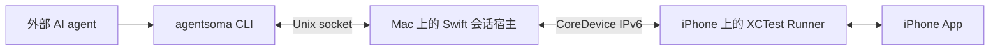

# AgentSoma

**为操作真实 iPhone 的 AI agent 提供眼睛和手。**

[English](README.md) · **简体中文**

[](https://github.com/HughLee824/AgentSoma/actions/workflows/ci.yml)
[](LICENSE)
[](Package.swift)

AgentSoma 是一个 macOS CLI，让外部 agent 能够发现 App、读取截图与辅助功能数据，并操作连接的 iPhone。自然语言理解、任务规划和结果判断由调用 agent 负责；AgentSoma 通过持续运行的 XCTest 会话提供设备观察与动作能力。

调用 agent 需要具备本机命令执行和 PNG 读图能力。设备控制链路在你的 Mac 和 iPhone 上本地运行。

[快速开始](#快速开始) · [命令概览](#命令概览) · [工作原理](#工作原理) · [文档导航](#文档导航) · [参与贡献](#参与贡献)

## 为什么选择 AgentSoma？

- **同时观察画面与界面结构。** 观察返回 PNG 路径、紧凑的辅助功能（AX）文本和元素引用，可用 `inspect` 展开或搜索缓存快照。
- **操作真实 App。** 发现已安装 App、切换前台、点击、滑动、拖动、编辑文本，以及发送 Return。
- **跨命令复用设备会话。** 独立 CLI 调用共享同一个 Mac 宿主和 iPhone Runner。`connect` 管理启动，`disconnect` 或空闲到期释放会话。
- **明确动作执行状态。** 区分 `completed`、`not_dispatched` 和 `unknown`。点击与滑动在派发前校验画面，输入动作在执行后检测帧稳定。
- **精简的原生技术栈。** 使用 Swift、Apple 设备工具和薄 XCTest Runner。运行时无需 Python、Node.js、WebDriverAgent、`iproxy` 或 `pymobiledevice3`。

## 快速开始

### 前置条件

| 要求 | 说明 |
| --- | --- |
| Mac 与 Xcode | 安装完整 Xcode，并选为当前开发工具链。仅安装 Command Line Tools 不够。 |
| 真实 iPhone | 通过 USB 连接，信任 Mac，启用 Developer Mode，并保持解锁。 |
| 开发签名 | Apple Development 证书及对应私钥，以及匹配设备和 Runner bundle ID 的 iOS development provisioning profile。 |

文档记录的实测环境为 **Apple Silicon · macOS 15.0.1 · Xcode 16.0 / Swift 6.0 · iPhone 12 Pro / iOS 26.6**，使用已有付费开发团队的签名。免费 Personal Team 的首次配置与续签尚未验收。兼容性边界见[当前限制](#当前限制)。

### 1. 安装并连接

开发时使用源码流程；发布资产可用后，也可以选择预编译包。两种方式的 Runner 准备步骤不同。

#### 从源码运行

```sh
git clone https://github.com/HughLee824/AgentSoma.git
cd AgentSoma
swift build
export PATH="$PWD/.build/debug:$PATH"

agentsoma --help
agentsoma devices
```

先在 Xcode 中完成[源码签名配置](docs/onboarding.md#源码开发入口)，再填写自己的开发团队 ID 和 `devices` 返回的设备 ID：

```sh
export APPLE_TEAM_ID="YOUR_TEAM_ID"
export IOS_UDID="DEVICE_ID_FROM_DEVICES"

agentsoma build-runner --team "$APPLE_TEAM_ID"

# 使用 build-runner 成功响应中的 result.xctestrun。
export SIGNED_XCTESTRUN="/absolute/path/from/build-runner.xctestrun"
agentsoma connect --device "$IOS_UDID" --xctestrun "$SIGNED_XCTESTRUN"
```

`build-runner` 使用仓库内的独立 Xcode 工程构建并校验已签名 Runner。兼容的构建可供后续连接复用；修改 Runner、共享源码、Xcode 或签名配置后需要重新构建。

#### 使用发布包

分发流程面向 **Apple Silicon / macOS 15+**。可用安装包以 [GitHub Releases](https://github.com/HughLee824/AgentSoma/releases) 为准。稳定版 Release 发布且 Tap formula 更新后，可运行：

```sh
brew install HughLee824/tap/agentsoma
agentsoma --version
```

也可以从 [GitHub Releases](https://github.com/HughLee824/AgentSoma/releases) 下载归档及配套 SHA-256 文件，校验后保留完整包目录。手动安装、升级和卸载步骤见[安装说明](docs/install.md)。

```sh
agentsoma devices
export IOS_UDID="DEVICE_ID_FROM_DEVICES"

agentsoma setup --device "$IOS_UDID"
agentsoma connect --device "$IOS_UDID"
```

`setup` 在本机重签预编译 Runner，验证设备握手、截图采集及正常退出后保存准备状态。它不编译源码、不登录 Apple，也不创建证书或 profile。需要明确签名选择时，可使用 `--profile`、`--team` 或 `--identity`，详见[首次接入](docs/onboarding.md)。

### 2. 观察、操作、验证

完成任意一种连接流程后，将 `connect` 返回的 `session` 填入变量：

```sh
export SESSION="SESSION_FROM_CONNECT"

agentsoma --session "$SESSION" status
agentsoma --session "$SESSION" apps --query Settings
agentsoma --session "$SESSION" open com.apple.Preferences
agentsoma --session "$SESSION" observe
```

读取返回的 `screenshot` 路径对应的 PNG，并结合 AX 文本判断界面。下方 ID 仅为示例，须替换为本次观察中实际返回的引用。

```sh
# 搜索已采集的快照，或直接查看已知元素。
agentsoma --session "$SESSION" inspect o1 --query General
agentsoma --session "$SESSION" inspect o1:e9

# 使用当前有效引用操作，再次观察并核对结果。
agentsoma --session "$SESSION" tap o1:e9
agentsoma --session "$SESSION" observe

# 完成后释放会话。
agentsoma --session "$SESSION" disconnect
```

基本循环是 **observe → 读取截图 → 按需 inspect → 执行动作 → 再次 observe**。动作完成不代表 agent 的业务任务已经成功。

## 命令概览

使用 `agentsoma --help` 或 `agentsoma <command> --help` 查看全部参数。会话命令采用 `agentsoma --session "$SESSION" <command>`。

| 命令 | 用途 |
| --- | --- |
| `devices` | 列出 CoreDevice 已知设备及其原生连接状态。 |
| `setup --device ID` | 为设备重签并验证发布包内的 Runner。 |
| `build-runner` | 从源码构建已签名 Runner，返回 `.xctestrun` 路径。 |
| `connect --device ID` | 启动会话，可用 `--idle-timeout 60m` 调整空闲时限。 |
| `status` | 检查会话健康状态和剩余空闲时间，不续期。 |
| `apps [--query TEXT]` | 按名称或 bundle ID 查找已安装 App，使用 `nextOffset` 继续分页。 |
| `open BUNDLE_ID` | 启动或激活已安装 App。 |
| `observe` | 采集 PNG 和紧凑 AX 文本，生成新引用。 |
| `inspect REF [--query TEXT]` | 读取或搜索缓存观察及其子树。 |
| `tap REF` | 点击元素；也可传观察 ID 并指定 `--x X --y Y`。 |
| `swipe REF --direction up` | 滑动元素，也支持明确端点、速度和按住时长。 |
| `type REF --mode replace --text TEXT` | 替换文本，或用 `--mode insert` 在已有焦点的光标处插入。`--stdin` 支持 UTF-8 文件或管道。 |
| `press REF --key return` | 向已有焦点的输入框发送 Return。 |
| `disconnect` | 等待已接收命令完成并清理会话。 |

坐标单位为**屏幕点**，不是截图像素。滑动方向表示手指移动方向。文本输入不会自动提交，需要时单独调用 `press`。文本限制、拖动参数与示例见[动作接口](docs/actions.md)。

## Agent 接入约定

`observe` 和 `inspect` 成功时输出多行文本；其他结果及运行时错误为单行 JSON。成功退出码为 `0`，运行失败为 `1`。参数语法错误输出到 stderr，并以非零状态退出。

调用 `open`、`tap`、`swipe`、`type` 和 `press` 时，除退出码外还要检查动作结果：

| 结果 | 含义 | 下一步 |
| --- | --- | --- |
| `completed` | 输入调用完成；tap/swipe/type/press 还通过了帧稳定检测。`open` 表示启动或激活完成。 | 再次观察，核对预期效果。 |
| `not_dispatched` | 在调用任何输入 API 前已拒绝请求。 | 阅读错误，修正请求或重新观察。 |
| `unknown` | 输入可能已生效，但无法确认完成状态。 | 先观察，不要盲目重复动作。 |

输入动作约每 200 ms 采样一次画面，至少三帧完全相同且跨度达到 400 ms 才视为稳定。5 秒检测预算内未稳定时，返回 `unknown` / `frame_stability_timeout`，并保留可获得的输入事实和最后一帧。该预算不是整条命令的硬超时。

调用 agent 应遵循以下约定：

- **动作后更新观察。** App 或设备动作完成、结果为 unknown 后，旧引用失效；检测到目标或上下文变化时也可能失效。动作结果截图不包含新 AX 引用，下一次按引用操作前需要 `observe`。
- **搜索已有快照。** `inspect --query` 先搜索全部已采集节点，再分页输出。它不会补采缺失数据，也不会恢复旧引用的有效性。
- **实际读取图片。** stdout 中的路径不会自动成为视觉输入，agent 必须通过自己的读图工具打开 PNG。
- **跟踪命令完成状态。** 如果命令工具返回后台任务 ID，须使用该工具的续读机制获取原命令的退出码和输出。这个 ID 与 AgentSoma 的设备 `session` 不同。
- **结束后释放会话。** 默认空闲时限为 30 分钟，`status` 不续期，已接收或执行中的命令不会被空闲回收打断。断开或到期后删除 socket 和观察缓存。

详细行为见[观察契约](docs/observations.md)、[动作契约](docs/actions.md)和[动作前画面校验](docs/screen-guard.md)。

## 工作原理



`connect` 启动宿主，并通过 Xcode 的 `test-without-building` 安装和启动 Runner，在两端均可响应后返回。宿主在各次 CLI 调用之间持有 XCTest 会话，串行处理设备请求、缓存观察并管理清理，无需单独启动服务。

会话文件默认位于 `/private/tmp/agentsoma-<uid>`，目录权限为 `0700`，可通过 `AGENTSOMA_STATE_DIR` 更换路径。发布包 Runner 的准备状态位于 `~/Library/Application Support/AgentSoma`。签名私钥留在 Keychain，设备 token 仅保存在宿主内存和 XCTest 子进程环境中。

| 目录 | 职责 |
| --- | --- |
| [`Sources/AgentSoma`](Sources/AgentSoma) | CLI 命令与参数解析。 |
| [`Sources/AgentSomaCore`](Sources/AgentSomaCore) | 会话、通信、观察、动作、签名和设备发现。 |
| [`Runner`](Runner) | 薄 iOS XCTest Runner 与独立 Xcode 工程。 |
| [`Tests`](Tests) | 宿主行为与设备契约的 Swift 测试，以及脱敏测试数据。 |
| [`scripts`](scripts) / [`packaging`](packaging) | 发布打包、校验与 Homebrew 工具。 |
| [`docs`](docs) | 公开使用指南、架构说明和精选示例。 |

## 当前限制

AgentSoma 处于早期开发阶段。真机验收覆盖上述实测环境，不代表所有 Mac、Xcode、iOS 版本或 App 均受支持。

- Swift 包目标为 macOS 13+，发布 Runner 的 iOS 编译下限为 17。这些是构建下限，不是完整链路的支持承诺。二进制分发面向 Apple Silicon / macOS 15+。
- 需要完整 Xcode 和本机开发签名。全新 Mac 接入及免费 Personal Team 的首次 provisioning、续签尚未验收。Mac CLI 使用 ad-hoc 签名，当前发布流程未包含 Developer ID 签名和公证。
- 截图与 AX 分开采集，不构成原子快照。默认观察文本最多 60 行 / 8 KiB，源采集最多 200 个节点；`inspect` 不能恢复未采集节点。
- 画面守卫属于启发式校验，不能原子地阻止 App 在输入前自行变化。XCTest 运行时兼容性以已测试配置为限。
- 不保证宿主被强制终止、Mac 重启、拔线或设备锁屏后的自动恢复。结果未知的动作不会自动重放。

## 文档导航

详细使用指南目前以中文提供，架构指南以英文提供；中英文 README 覆盖相同的入门流程。

| 文档 | 内容 |
| --- | --- |
| [安装说明](docs/install.md) | 发布包、Homebrew、升级与卸载。 |
| [首次接入与故障排查](docs/onboarding.md) | Xcode、签名、首次连接、续签和常见错误。 |
| [设备与 App 发现](docs/discovery.md) | 发现命令、分页与 CoreDevice 诊断。 |
| [观察契约](docs/observations.md) · [输出样例](docs/examples/observe/README.md) | 截图、AX 文本、缓存查询、引用及示例。 |
| [动作接口](docs/actions.md) · [画面校验](docs/screen-guard.md) | 输入语义、可控拖动、稳定检测与派发前检查。 |
| [架构与仓库布局](docs/architecture.md) | 模块职责、会话生命周期，以及公共文件与本地文件的边界。 |
| [发布流程](docs/release-setup.md) | CLI 与 Runner 的构建、校验及分发。 |

## 参与贡献

欢迎提交 issue、聚焦的 pull request 和可复现的设备问题报告。较大改动建议先通过 [issue](https://github.com/HughLee824/AgentSoma/issues) 讨论范围。

提交前运行与 [CI](.github/workflows/ci.yml) 一致的检查：

```sh
swift test
python3 -m unittest discover -s scripts/tests -v
```

Python 3.9+ 仅用于发布工具及其测试，不是已安装 CLI 的运行依赖。唯一 Swift 包依赖为 [Swift ArgumentParser](https://github.com/apple/swift-argument-parser/tree/1.5.0)，锁定版本 `1.5.0`。

CI 没有真实 iPhone。涉及设备行为的改动还需重新构建 Runner，并在真机验证受影响流程。问题报告应包含 Mac/Xcode/iOS 版本、复现步骤、预期行为和相关错误。分享日志前移除私人画面内容、provisioning profile 和签名资料。修改公共使用说明时，请同步更新中英文 README。新增文件请遵循[目录约定](docs/architecture.md#repository-layout)，本地实验和设备记录不进入 Git。

## 许可证

[MIT](LICENSE) © AgentSoma contributors。
