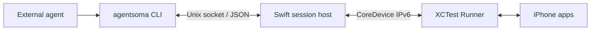

# Architecture and repository layout

AgentSoma provides observations and actions for an external agent operating a physical iPhone. The calling agent owns task planning, image interpretation, and judging outcomes. AgentSoma owns device access, reference validity, execution facts, and session cleanup.

## Runtime components



The CLI and host are two process roles of the same executable. A connection starts a host for that session; the host launches the Runner with Xcode's `test-without-building`. Subsequent CLI calls reuse that host and XCTest session.

| Component | Owns |
| --- | --- |
| [CLI](../Sources/AgentSoma/AgentSoma.swift) | Argument parsing, command dispatch, text/JSON output, and exit codes. |
| [Session client](../Sources/AgentSomaCore/SessionClient.swift) | Host startup, local IPC, response matching, and transport uncertainty. |
| [Session host](../Sources/AgentSomaCore/SessionHost.swift) | Serial request execution, device ownership, observation references, outcome classification, and lifecycle coordination. |
| [Observation cache](../Sources/AgentSomaCore/Observation.swift) | AX compaction, cached snapshots, queries, pagination, and reference invalidation. |
| [XCTest backend](../Sources/AgentSomaCore/XCTestBackend.swift) | Xcode process management, Runner capability checks, CoreDevice transport, and backend cleanup. |
| [Device discovery](../Sources/AgentSomaCore/DeviceDiscovery.swift) | Device metadata, installed-app queries, and native-tool diagnostics. |
| [Runner setup](../Sources/AgentSomaCore/RunnerSetup.swift) / [source build](../Sources/AgentSomaCore/RunnerBuild.swift) | Preparing a packaged Runner with local signing, or building a signed Runner from source. |
| [iOS Runner](../Runner/LiveSessionTests.swift) | Screenshots, AX collection, app activation, input primitives, device-side checks, and execution facts. |

The Runner does not own agent-facing observation IDs, short references, snapshot caches, or task strategy. It receives resolved targets or coordinates from the host. Tap/swipe use screen-context and fingerprint checks; type/press use AX target checks. The host interprets returned execution facts as `completed`, `not_dispatched`, or `unknown`.

The native Xcode project shares `FrameStability.swift`, `ScreenGuard.swift`, and `XCTestDiagnostics.swift` from `Sources/AgentSomaCore`. Keep these paths intact when changing the Runner project. The production build does not depend on local experiments, an installed test Fixture app, or XcodeGen.

## Session lifecycle

1. `connect` resolves the device, acquires its lock within the state directory, starts the backend, and returns a session ID after readiness checks.
2. Independent CLI processes send requests through the session's Unix socket. Device requests run serially; the host retains observations between calls.
3. Starting a new observation invalidates previous references. The cache keeps the latest two successful observations; `inspect` can read a retained snapshot without making its references current again.
4. Before a device action, the host resolves the reference and marks existing references pending. Completion, an unknown outcome, or a detected target change invalidates them. A confirmed pre-dispatch rejection can preserve them when no other invalidation occurred.
5. `disconnect` stops admission, finishes accepted work, and releases the session's resources. Idle expiry follows the same cleanup path. Socket and observation files are removed; diagnostic files may remain.

The idle timeout defaults to 30 minutes and accepts `s`, `m`, or `h` units through `connect --idle-timeout`. Successful `apps`, `observe`, and `inspect` renew it when they finish. Valid `open` and locally resolved action requests also renew it, including unknown outcomes. Argument/reference failures do not renew it. `status` checks health without renewing the timeout. Accepted, queued, or running requests are protected from idle cleanup.

The host does not automatically replay unknown actions or restore old references after restarting. See [observations](observations.md), [actions](actions.md), and [screen guards](screen-guard.md) for detailed contracts.

## Repository layout

```text
AgentSoma/
├── .github/workflows/               # CI and release workflows
├── Package.swift                    # Executable, core library, and test resources
├── Package.resolved                 # Pinned Swift dependency resolution
├── Sources/
│   ├── AgentSoma/                   # CLI entry point
│   └── AgentSomaCore/               # Host and device integration
├── Runner/
│   ├── AgentSomaRunner.xcodeproj/   # Shared project and scheme
│   └── LiveSessionTests.swift       # Device-side Runner
├── Tests/AgentSomaCoreTests/
│   ├── Fixtures/Observations/       # Sanitized AX regression data
│   └── *.swift                      # Tests and synthetic image helpers
├── docs/
│   ├── examples/observe/            # Curated CLI output example
│   └── *.md                        # Public guides and architecture
├── scripts/                         # Release tooling and its tests
├── skills/agentsoma/                # Installable agent instructions and call templates
├── packaging/homebrew-tap/          # Tap setup and update workflow
├── README.md                        # Default English entry point
├── README.zh-CN.md                  # Chinese entry point
└── LICENSE
```

Commit files needed to build, test, distribute, or understand the public project. Keep the Swift lockfile, shared Xcode project/scheme, release scripts, and sanitized test fixtures in Git. Xcode user settings are local; do not ignore all `.xcodeproj` files.

Test inputs belong under `Tests/AgentSomaCoreTests/Fixtures` and are loaded through SwiftPM's resource bundle. Tests must pass in a fresh checkout without `spikes/`, private device captures, or files under `docs/examples`. Published examples should illustrate the current interface, use placeholder paths and IDs, and identify any omitted media.

## Local-only files

The [.gitignore](../.gitignore) separates local development material from the public tree:

| Local material | Location or pattern |
| --- | --- |
| Swift/Xcode build output | `.build/`, `.swiftpm/`, `build/`, `DerivedData/`, `*.xcresult/`, `*.xcarchive/`, `*.dSYM/`, `*.ipa` |
| Personal notes and working copies | `.local/`, `alignment.md`, `docs/analysis/` |
| Early device experiments and evidence | `spikes/` |
| Retired design discussions | `docs/agent-interface.md`, `docs/cli-vs-mcp.md`, `docs/session-host.md`, `docs/v0.1-plan.md` |
| Original observation drafts and captures | The retired sample paths explicitly listed in `.gitignore`; curated output stays public. |
| Machine settings and caches | `.DS_Store`, `xcuserdata/`, `*.xcuserstate`, `__pycache__/`, Python bytecode, `*.log` |
| Signing and environment files | `*.mobileprovision`, `*.provisionprofile`, `*.p12`, `*.pfx`, `*.p8`, `.env*` except `.env.example` and `.env.*.example` |

New private notes and device records should go under `.local/`. Original development files can remain at their ignored paths for local use. Share only intentionally curated, sanitized excerpts; do not add broad exceptions for raw evidence directories.

Ignore rules do not remove files already tracked by Git. Use `git rm --cached` for a file that should remain on disk but leave the repository, and commit that change. An ordinary removal affects later commits; earlier commits still contain their original contents.

## Runtime storage

Session files default to `/private/tmp/agentsoma-<uid>`; `AGENTSOMA_STATE_DIR` can choose a different, short path. Directory permissions are `0700`. A device lock is scoped to the state directory and is released when its holder exits.

Packaged Runner preparation is stored in `~/Library/Application Support/AgentSoma`, separate from the source checkout and install directory. It contains locally re-signed artifacts and the user's provisioning profile. Private keys remain in Keychain. The device token stays in host memory and the XCTest subprocess environment rather than configuration files or CLI output.

See [installation](install.md), [onboarding](onboarding.md), and [release tooling](release-setup.md) for setup, renewal, and distribution.
